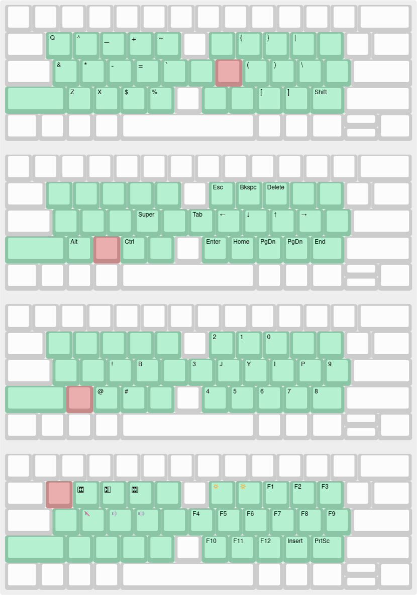

# Jazz 

Have you ever thought about how hilarious it is that `j` is right under your index finger on a QWERTY keyboard? I mean, what a joke. People try to remedy this by using alternative keyboard layouts. These help, but they take a long time to learn, and they still don't help you reach the numbers, punctuation keys, etc. In fact, I think that for a programer who needs easy access to all the letters and symbols on the keyboard, no homerow typing method will work because there just aren't enough keys within easy reach of your fingers. For a while I used an alternative method where I rested my fingers on `aser nio'` on a QWERTY keyboard, so that my fingers were on the most commonly used letters. This made several symbols easier to reach, and required minimal relearning because the layout was still the same. But I would still make mistakes all the time when pressing keys like `- = [ ] \`. So I created this program Jazz, which lets you chord the `j x z q` keys with other keys to access every key on the keyboard with hardly any hand movement. It's kind of like Vim but much simpler, and works on top of every application on your computer.

# Some Useful Hotkeys

Here are some hotkeys that everyone should know, whether or not you use Jazz. These work in most programs, i.e. most web browsers, text editors, terminals, etc.:

|||
|---|---|
|`Ctrl+Left`, `Ctrl+Right`|Move the cursor a full word left / right|
|`Ctrl+Backspace`, `Ctrl+Delete`|Delete a full word behind / in front of the cursor|
|`Home`, `End`|Jump to the start / end of the line|
|`Ctrl+Home`, `Ctrl+End`|Jump to the start / end of the document / text box|

These can also be combined with `Shift` to select text. The following are browser specific and are supported by most (all?) major browsers:

|||
|---|---|
|`Ctrl+T`|Open a new tab|
|`Ctrl+W`|Close the current tab|
|`Alt+D`|Select all the text in the address bar|
|`Alt+Left`|Go back|

If you are not using these then you are suffering needlesly. (In the browser, `Ctrl+Shift+T`, `Ctrl+R`, and `Ctrl+N` are also useful, but I'd forgive you for not knowing them.)

# Usage

While jazz is running, the `j`, `x`, `z`, and `q` keys are repurposed to be combined with other keys to enter symbols that are harder to reach on the keyboard. These four keys are called the root keys. You can either press a root key once just to modify the next keypress, or you can hold a root key to modify several key presses. `Ctrl`, `Shift`, and `Alt` are also modified to work that way. Here are the key pages for the four root keys, with the roots shown in red. The green keys show roughly the area of the keyboard that is in use with Jazz:

As you can see, every key on the keyboard is brought close to your fingers on a standard American QWERTY keyboard using this scheme. `j`, `x`, `z`, and `q` can be found in the `j` page for when you need to type them normally. `y`, `b`, and `p` are also included because they are hard to reach normally, and `i` because it is hard to type `ik` or `ki`.

# Installation

To install Jazz:
1) Install [Interception Tools](https://gitlab.com/interception/linux/tools#installation)
2) Clone this repository
3) `sudo make install`. This will start Jazz, and make it start automatically when you turn on your computer. This will only change one file outside of the repository, which can easily be removed with `sudo make uninstall`. Interception tools has it's own Systemd service which Jazz simply hooks into.

You can stop Jazz at any time by typing `bye` using the actual `b` and `y` keys, or with `sudo systemctl stop udevmon.service`. You can then start it again with `sudo systemctl restart udevmon.service`, which you can bind to a hotkey of your choice.

# Repository Structure

The layouts folder contains keyboard layouts in a `json` format meant to be used with `keyboard-layout-editor.com`. Copy and paste the layouts into their editor to view or edit them. `evshow` is a simple test program that reads `input_event` structs on `stdin` and formats their contents to `stdout`.

<!-- # Extensions and Internationalization
At the moment Jazz only works on Linux. I suspect that the best way to port it to Windows will be to rewrite it in AutoHotkey? I don't know what complications would arise in a port to Mac.

If anyone happens to like Jazz enough that they want to make a modified version either with their own extensions or with international characters, I think it would be best if we find a way to include it in this same repository and you make a pull request. That way we can keep all variations in the same place. -->
